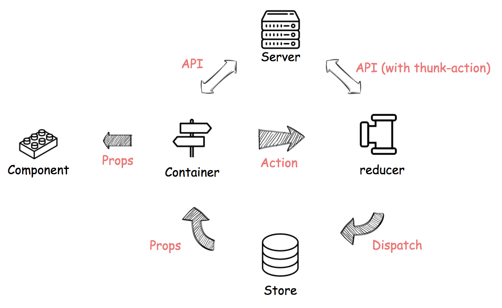

# ReactJS로 프로젝트 진행하기
```
npm install -g create-react-app
create-react-app my_app
cd my_app
```
or
```
git clone https://github.com/cresumerjang/temp-react.git
cd my_app
```
and
```
npm install
npm run start
```
## Need to know
- __ES6__ (react 컴포넌트 작성시 자주 사용되는 ES6 문법)
    - [class](https://developer.mozilla.org/ko/docs/Web/JavaScript/Reference/Statements/class)
    - [import](https://developer.mozilla.org/ko/docs/Web/JavaScript/Reference/Statements/import) / [export](https://developer.mozilla.org/ko/docs/Web/JavaScript/Reference/Statements/export)
    - [arrow function](https://developer.mozilla.org/ko/docs/Web/JavaScript/Reference/Functions/%EC%95%A0%EB%A1%9C%EC%9A%B0_%ED%8E%91%EC%85%98)
    - [map](https://developer.mozilla.org/ko/docs/Web/JavaScript/Reference/Global_Objects/Array/map)
    - [filter](https://developer.mozilla.org/ko/docs/Web/JavaScript/Reference/Global_Objects/Array/filter)
    - [let](https://developer.mozilla.org/ko/docs/Web/JavaScript/Reference/Statements/let) / [const](https://developer.mozilla.org/ko/docs/Web/JavaScript/Reference/Statements/const)
    - [destructuring assignment](https://developer.mozilla.org/ko/docs/Web/JavaScript/Reference/Operators/Destructuring_assignment)
- __ReactJS__ ([Quick Start](https://reactjs.org/docs/hello-world.html) / [Advanced Guide](https://reactjs.org/docs/jsx-in-depth.html))
    - State(props, state)
    - Component lifecycle
    - Etc
        - jsx
        - form(controlled/uncontrolled components)
        - event handling
        - lifting state up
- __Redux__ (효율적인 상태 관리를 위한 [Redux](https://deminoth.github.io/redux/) / [Example code](https://deminoth.github.io/redux/introduction/Examples.html))
    - action, reducer, store...
- __Etc__
    - 환경설정 관련 이슈 대응을 위한 [webpack](https://webpack.js.org/) 학습


## Considerations
- __Model__(redux를 통한 상태 관리)
    - 
    - action 생성 및 모듈 관리 rule
    - reducer 생성 및 모듈 관리 rule
- __View__(재사용 단위 고려한 container/component 작성)
    - component 재사용 고려 범위를 page definition에 근거한 region 단위로 제한.
    - region을 벗어나면 동일 UI일 지라도 component를 재작성하여 리즌 단위로 폴더 구성하여 관리.
    - scss 파일도 컴포넌트와 동일한 계층으로 구성하고 관리.
- __[유용한 모듈](https://deminoth.github.io/redux/introduction/Ecosystem.html) & 라이브러리__
    - react-redux (require)
    - redux-thunk (비동기 액션을 만들기 위한 모듈)
    - axios
    - redux-logger (모든 리덕스 액션과 다음 상태에 대한 기록)
    - redux-form (리덕스 스토어를 통한 from 컴포넌트 상태 관리 지원)
    - redux-devtools (리듀서 에러 핸들링을 위한 액션 로거)
    - reselect (효율적인 데이터 셀렉터)
    - lodash

## Reference
#### 적용 사례 & 후기
- http://huns.me/development/1953
- https://jae-kwang.github.io/blog/2018/02/04/project-react/
- https://www.ridicorp.com/blog/2017/09/13/how-to-develop-ridistory-front/

#### 리액트 학습 참고
- https://deminoth.github.io/redux/
- http://d2.naver.com/helloworld/1848131
- https://github.com/reactjs/redux
- [Youtube - React.js 강좌 시리즈](https://www.youtube.com/playlist?list=PL9FpF_z-xR_GMujql3S_XGV2SpdfDBkeC)
- [모던 자바스크립트 개발자를 위한 리액트 프로그래밍](https://www.youtube.com/playlist?list=PLBXuLgInP-5lJA_ZDXp8rlDwH2ZMNX-qG)
- [Code Splitting in Create React App](https://serverless-stack.com/chapters/code-splitting-in-create-react-app.html)
